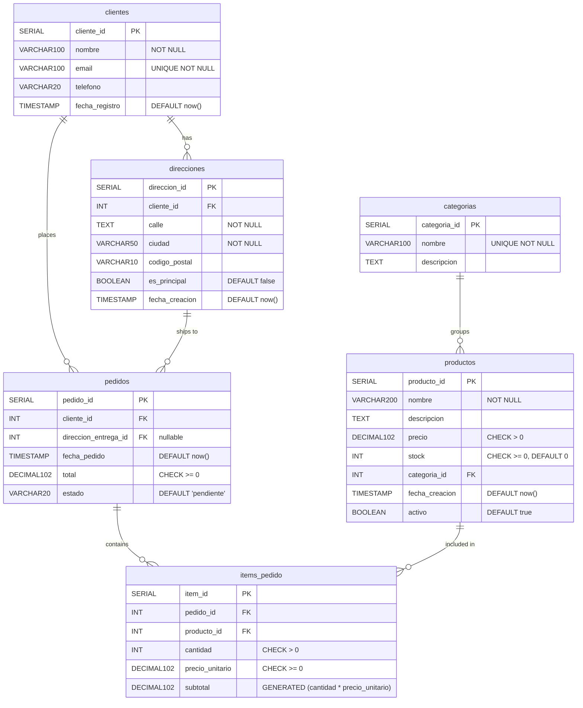

# Entity Relationship Diagram — Workshop Schema

---

## Relationships

| From | To | Type | On Delete |
|------|----|------|-----------|
| `clientes` | `direcciones` | 1 to many | CASCADE |
| `clientes` | `pedidos` | 1 to many | RESTRICT |
| `direcciones` | `pedidos` | 1 to many (nullable) | RESTRICT |
| `categorias` | `productos` | 1 to many | RESTRICT |
| `pedidos` | `items_pedido` | 1 to many | CASCADE |
| `productos` | `items_pedido` | 1 to many | RESTRICT |

## Key Constraints

| Table | Column | Constraint |
|-------|--------|------------|
| `clientes` | `email` | UNIQUE |
| `categorias` | `nombre` | UNIQUE |
| `productos` | `precio` | CHECK > 0 |
| `productos` | `stock` | CHECK >= 0 |
| `pedidos` | `total` | CHECK >= 0 |
| `pedidos` | `estado` | CHECK IN ('pendiente','procesando','enviado','entregado','cancelado') |
| `items_pedido` | `cantidad` | CHECK > 0 |
| `items_pedido` | `subtotal` | GENERATED ALWAYS AS (cantidad * precio_unitario) |
